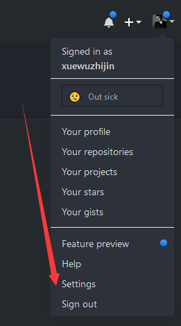
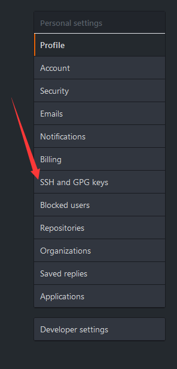
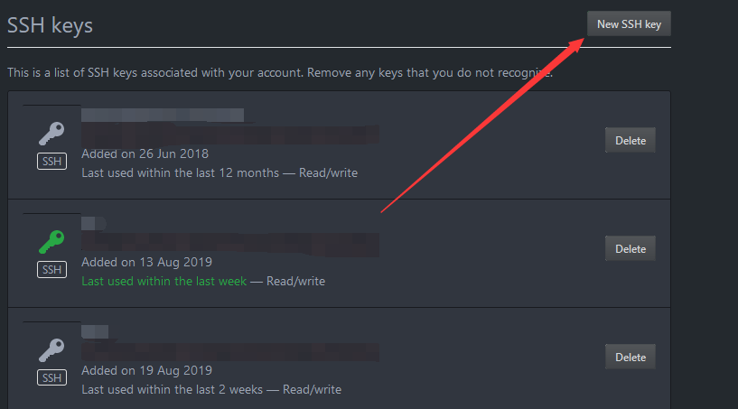
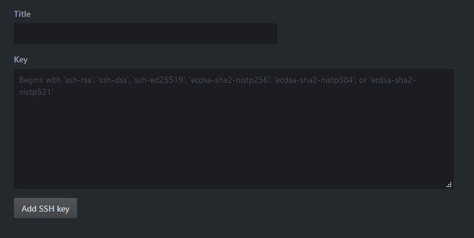

# 记下使用GIT日常使用的技巧

## 目录

 * [SSH-CONFIG](#SSH-CONFIG)
 * [GIT-SSH](#GIT-SSH)
 * [GIT-IGNORE](#GIT-IGNORE)


### SSH-CONFIG

程序员日常生活中如果和 git 打交道，难免碰到一台电脑多个 git 账户，比如有公司的，自己的，当你使用公司的 git 账户下载，那么 git ssh 匹配你默认的 ssh 私钥（公司），但如果你下载自己账户仓库中的代码，此时如果依旧匹配公司的 ssh 私钥，那么显然会提示你
> Please make sure you have the correct access rights and the repository exists.

或者
> Permission denied (publickey). fatal: Could not read from remote repository.

此时有一个很好的方式去解决该问题

1. 在电脑当前用户目录下找到.ssh（找不到就先查看是不是隐藏了，否则创建一个 `.ssh` ）文件 **夹！！**

*windows 用户打开我的电脑 -> 你的系统盘 -> 用户（User） -> 你当前电脑使用的用户名(Your User Name of Compute) -> .ssh*

*如果你的当前处于 git Bash 模式，直接执行 `cd ~/.ssh` 如果 cd 不进去代表没有，创建一个*

*MAC与Linux系统 `cd ~/.ssh`, 如果没有也创建一个*

2. 创建一个 `config` 文件，注意，没有后缀，没有 `.`，根据下面模板自己修改修改

```bash
# 假设这是公司的账户
Host git_one                            # git_one 自己取，怎么方便怎么来
    User git_one_account                # 这个是用户名，可选项，在 ssh 上比较方便
    HostName github.com                 # 这个是登录的域，可以github、可以gitlab
    PreferredAuthentications publickey  # 这个选项有几种方式，这里选公钥
    IdentityFile ~/.ssh/git_one_rsa     # 告诉它这个账户的私钥放在哪里
    IdentitiesOnly yes                  # 仅使用在命令行上指定的身份验证身份文件或在config文件中配置的身份验证身份文件

# 假设这是自己的账户
Host git_two
    User git_two_account
    HostName github.com
    PreferredAuthentications publickey
    IdentityFile ~/.ssh/git_two_rsa
    IdentitiesOnly yes
```

> 如果没有设置 GITHUB 公私钥请看目录2或者点击这里 -> [GIT-SSH](#GIT-SSH)

通常在克隆 git 仓库时，使用的方式不外乎两种，例如：
1. git clone https://github.com/xuewuzhijin/Learning-Code.git

*使用第一种方式在克隆时要求你登录用户名与密码才可以下载，前提仓库需是私有的*

2. git clone git@github.com:xuewuzhijin/Learning-Code.git

*使用第二种方式就要求提供公私钥配对，在这里我们使用第二种。*

**在克隆前修改地址**

```bash
#修改前
git clone git@github.com:xuewuzhijin/Learning-Code.git

#修改后
git clone git@bill:xuewuzhijin/Learning-Code.git
```

**如果在克隆后修改地址**

```bash
# 1. 通过修改 项目 配置文件
# 首先 cd 到你的项目根目录
vim .git/config
# [remote "origin"]
#         fetch = +refs/heads/*:refs/remotes/origin/*
#               下面这行改一改就行
#         url = git@bill:xuewuzhijin/Learning-Code.git
# [branch "master"]
#         remote = origin
#         merge = refs/heads/master

# 2. 通过 git 命令修改，注意，这里顺序不能变
git remote set-url --add origin 你要改之后的项目地址
git remote set-url --delete origin 你之前的该项目地址
```

### GIT-SSH

配置公钥私钥的主要作用就是当你账户下面的 repositories 包含多个 私有 repo 时，一个私钥都可以下载所有的，但前提是需要在 github 上添加上你创建的公钥私钥里面的公钥，流程：

登录你的 github 账户并把鼠标移动到（右上角）你的头像上方点击出现下拉框，点击 `Settings -> personal settings[SSH and GPG keys] -> New SSH key`






GITHUB 也提供了一个创建公私钥 文档，你可以前往官网查看如何创建，懒得跑就接着往下看，反正我也是照搬 ------我是一张飞机票------> [generating-a-new-ssh-key-and-adding-it-to-the-ssh-agent](https://help.github.com/en/github/authenticating-to-github/generating-a-new-ssh-key-and-adding-it-to-the-ssh-agent)


<details>

<summary>创建 GITHUB 的公私钥</summary>

**生成新 SSH 密钥**

1. 打开命令行工具（windows CMD 或 GIT， MAC与Linux Terminal）

2. 粘贴下面的文本（替换为您的 GitHub 电子邮件地址）。

```bash
$ ssh-keygen -t rsa -b 4096 -C "your_email@example.com"
```

这将创建以所提供的电子邮件地址为标签的新 SSH 密钥。

```bash
> Generating public/private rsa key pair.
```

3. 提示您“Enter a file in which to save the key（输入要保存密钥的文件）”时，按 Enter 键。 这将接受默认文件位置。

```bash
> Enter a file in which to save the key (/home/you/.ssh/id_rsa): [Press enter]
```

4. 在提示时输入安全密码。 更多信息请参阅“使用 SSH 密钥密码”。

```bash
> Enter passphrase (empty for no passphrase): [Type a passphrase]> Enter same passphrase 
```

**将 SSH 密钥添加到 ssh-agent**

将新 SSH 密钥添加到 ssh-agent 以管理密钥之前，应检查现有 SSH 密钥并生成新 SSH 密钥。
1. Start the ssh-agent in the background.

```bash
$ eval "$(ssh-agent -s)"
> Agent pid 59566
```

2. 将 SSH 私钥添加到 ssh-agent。 如果您创建了不同名称的密钥，或者您要添加不同名称的现有密钥，请将命令中的 id_rsa 替换为您的私钥文件的名称。

```bash
$ ssh-add ~/.ssh/id_rsa
```
3. 将 SSH 密钥添加到 GitHub 帐户。



</details>

**创建成功后 ！这里是重点！**

当你创建成功后，你的 .ssh 下有产生两个文件， `id_rsa` (私钥，放置在你电脑上)以及 `id_rsa.pub` (公钥，放置在你的 GITHUB 上)，流程：

1. 点击 New SSH Key，进入到如下页面




2. `Title` 你给的名字，名字自定，用于区别你添加的这个公钥是位于哪台电脑或是用来干嘛的，`Key` 是你刚刚创建的公钥，**(.pub后缀的)**

```bash
# 假设刚刚创建的私钥是这个名字 id_rsa.pub（默认情况下是这个名字）
cat ~/.ssh/id_rsa.pub
# 它会返回一串下面的字符串，把返回的字符全部复制，粘贴到页面里的 key 中
# ssh-rsa AAAAB3NzaC1yc2EAAAADAQABAAACAQDY/O9haUDI+5X8GuwIGHrKMjCYbsh59fDxCtlevl+jXxijSdZvRaAHOo3MfDuSa0j1P5NibOvp4Gqxgs+tvDL8eG4skrjsPZv3vYUVeJuZOS7YSTYuS0ELEEA6IVELWEoSArb6W3ZTMsMbatMggsqSFvKBpnJ2PB84K/Bcsr+WhGg3yOiv7qPiQRGJ5StsFVk0N+Ga4r3IVN41p9UmavCaYvbdal1Zibh9aDfvjBgIpfu9Fyqn+gGTXfvtvWUgkRCBe8V2zuhdHruswOHuU535eLBXBcectr4zm9H85eOrFi8ITA8SnflHDBTK0/SmrXW52oSZYxcluEBegWyl6Sc1PYHPqC09A74RDi49eNYmyyjQCRPiAbMwVEOvtgBGZJwkpRiEdlaADz25NgSt2s3qocpW8qp0l/Ga4r3IVN41p9UmavCaYvbdal1Zibh9aDfvjBgIpfu9Fyqn+8fosIssF54zQThzteEgnHdXnWXgv/m6dkDYUEiWS2qNmFeYk2gt4k/gGTXfvtvWUgkRCBe8V2zuhdHruswOHuU535eLBXBcectr4zm9H85eOrFi8ITA8SnflHDBTnrEuB0uxhavHSV9kIpJtdeTZRcmGysveB4N+cTaXusKWY/ZQFswLF6r71zsy4mX3A2I/gJRtipk4W9w== xxx@xxx.xx
```

点击 `Add SSH key` 完成设置


### GIT-IGNORE

在项目中，可能会碰到一些无法被忽略的文件，比如说当前项目被推送到了线上仓库，而突然看到了N个不想上传的文件，并且你想怎么忽略都忽略不了，莫名的怀疑网上写的都是些过时的、错误的、或者怀疑自己漏掉了。

造成这结果的根本原因是你第一次提交（commit）的时候，该文件没有被忽略，而之后你想再次忽略它，git 的内部机制就是不会去忽略已追踪的文件，所以这个你不想看到的文件就一直在上面，造成了一种（就喜欢你看到我又干不掉我的样子）


```bash
# 这一步清除本地所有已追踪的文件
git rm -r --cached .
# 再把所有未追踪的全部添加(这一步会重新过滤掉在 .gitignore 中忽略的文件)
git add .
# 更新 .gitignore 文件
git commit -m "update .gitignore"

# 这一步不会把这个提交信息更新到未变更的文件夹上，但前提是除了修改 .gitignore 文件外，其它文件在你上一次 git push 后没有更改过

# 简单粗暴接地气的说，就是你要执行这一步，首先你要全部提交更新，接着再执行这里的第一步，否则除了被你修改的 .gitignore 之外，其它被修改的文件也会有 update .gitignore 标记
```

Q: 那么有没有一种命令就是这个文件被我忽略了，但是这个版本又想让它上传的命令?

A: **有**

```bash
# 强制添加到暂存库，意思就是，原本 main.js 被我忽略掉了，现在我不想忽略它，那么强制把 main.js 加进去
git add -f main.js
```

附送一个比较鸡肋的命令，但有时候你找不到原因还有挺有用的，比如说，根目录有一个 index.js 文件， 根目录的 app 下也有个 index.js，但你的 .gitignore 中有一条这样的规则 `index.js` 造成的结果就是，所有的 index.js 都被忽略，但要怎么看是哪里写错了？

```bash
git check-ignore -v index.js
# or
git check-ignore -v app/index.js
# 它会返回下面的规则，告诉你在根目录下的 .gitignore 中的第六行中忽略了该文件的规则 
# .gitignore:6:index.js  index.js
```