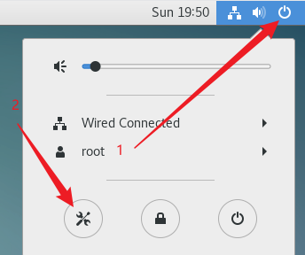
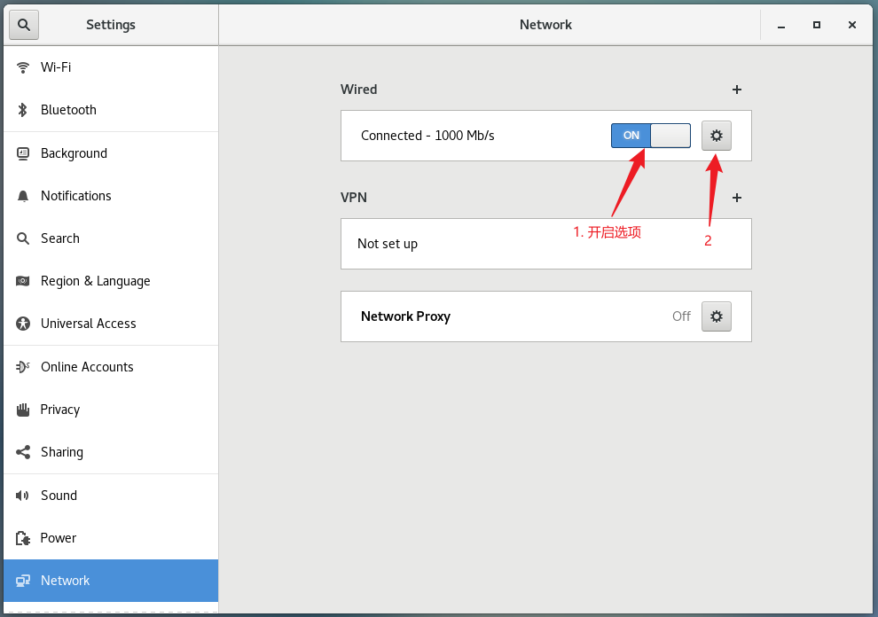
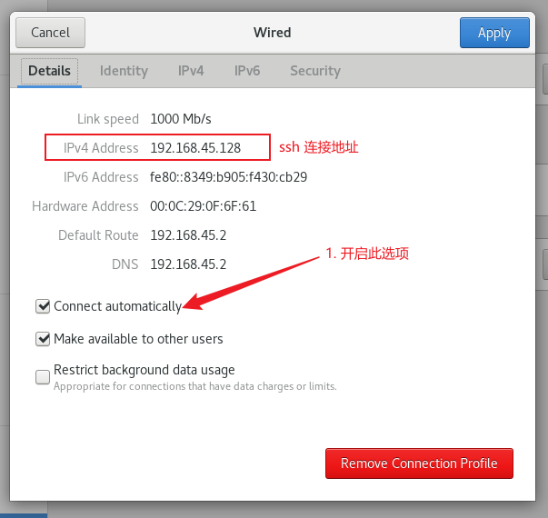
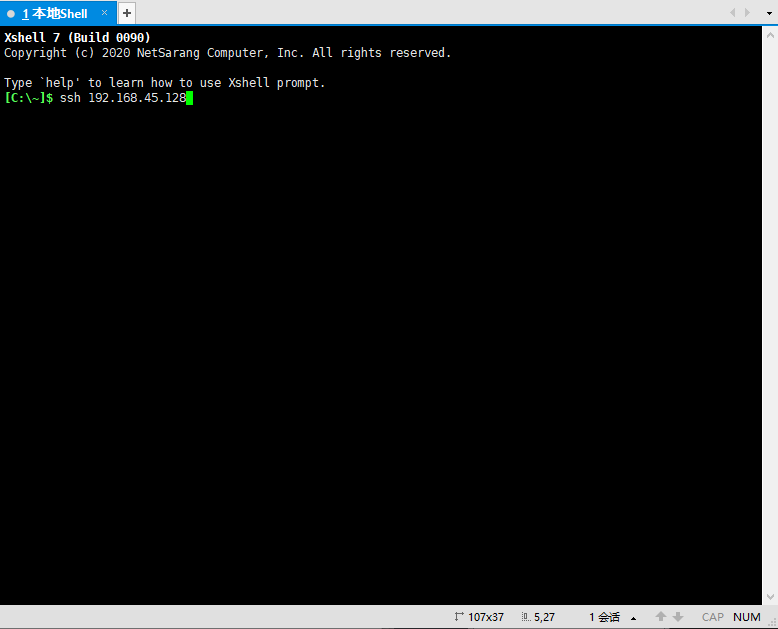
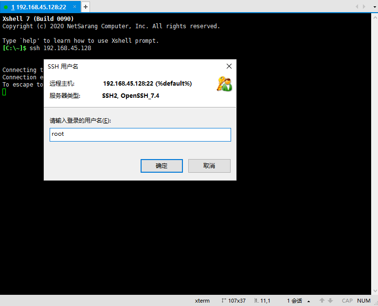
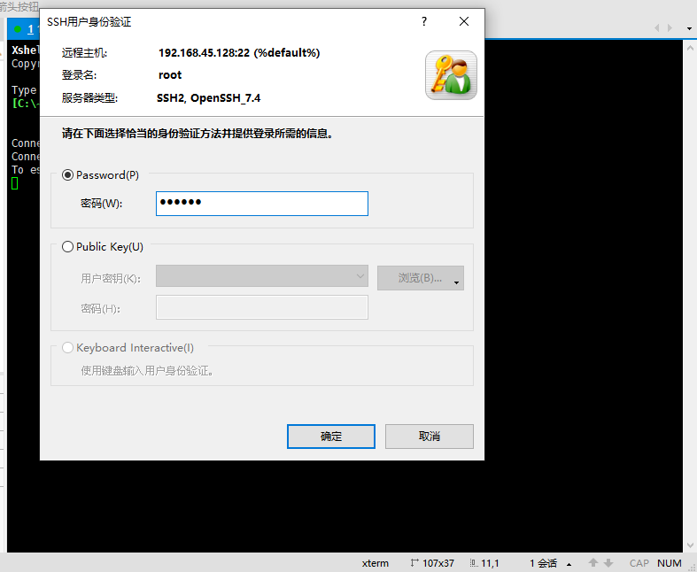
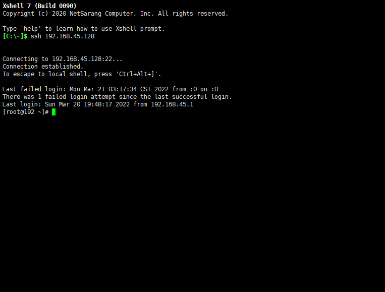
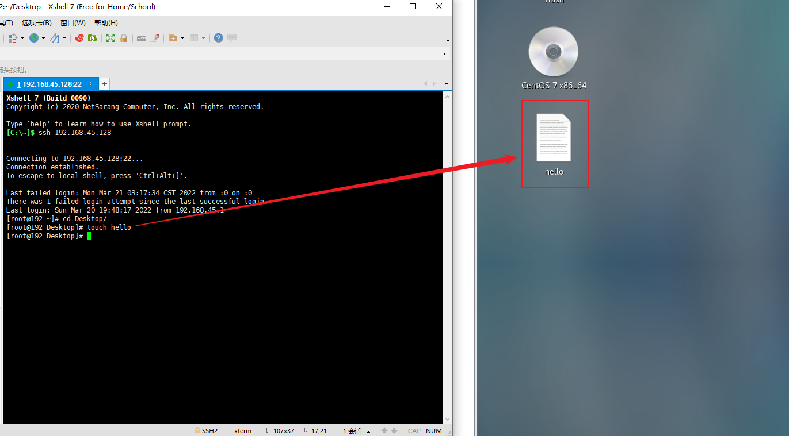

# XShell 连接虚拟机

首先打开系统的设置



然后在左侧找到 Network(网络) 设置

在选项未开启前，虚拟机处于未联网状态，所以需要开启此选项



选中自动连接选项，这样可以不用每次开机都需要手动开启网络


```bash
# 回到 Windows，打开 XShell 终端工具，连接虚拟机 
# 该地址是你电脑上上面图片中的 IPv4 地址
ssh 192.168.45.128
```



然后终端工具将会弹出窗口输入用户名以及密码




连接成功后将会显示如下画面



```bash
# 此时，通过 XShell 就可以控制虚拟机了

cd Desktop/ # 如果你的虚拟机选择的是中文，那么输入 cd 桌面/
touch hello
```

