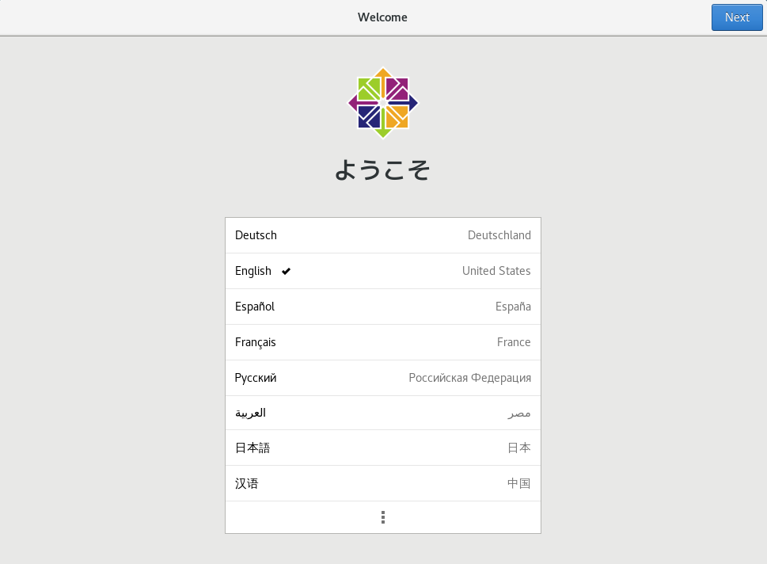
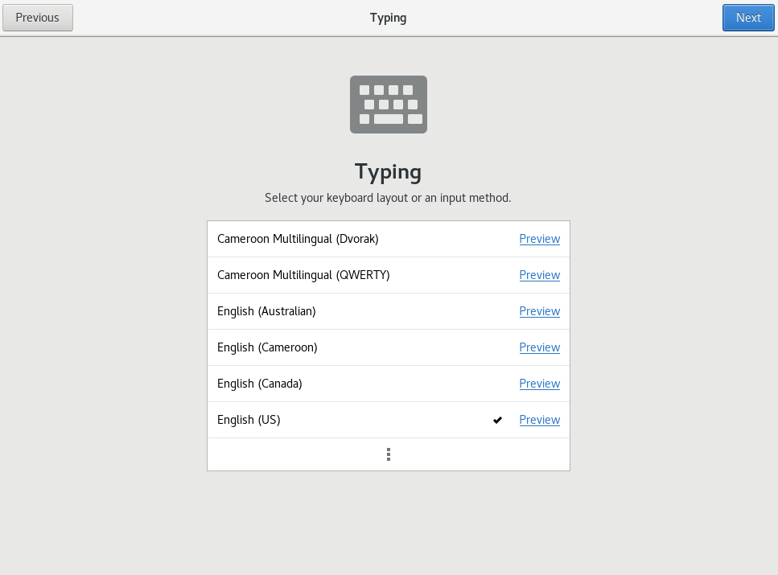
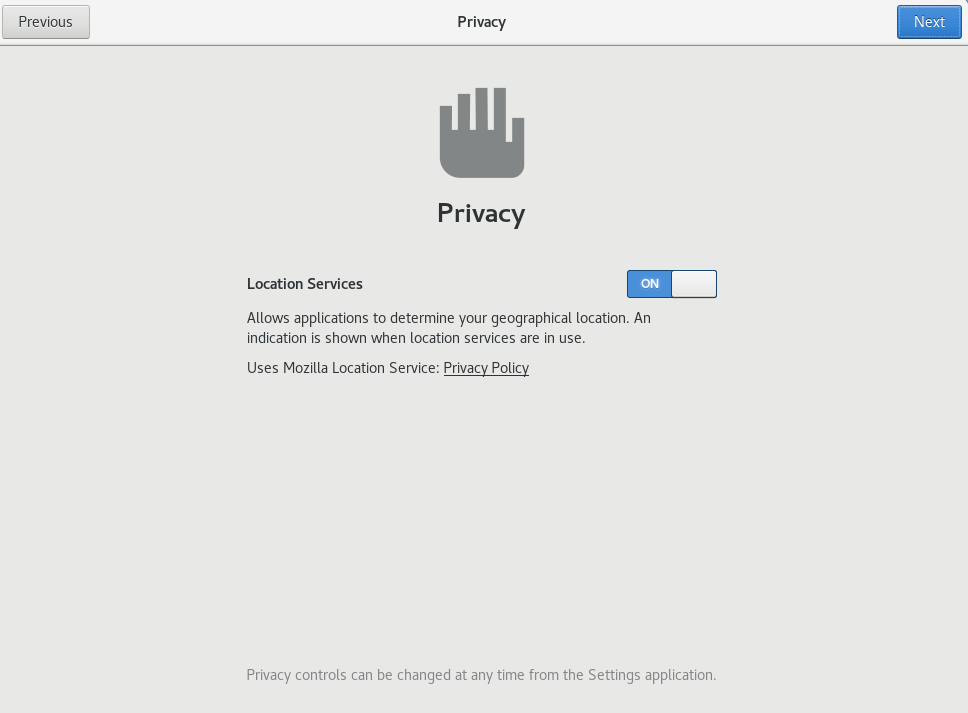
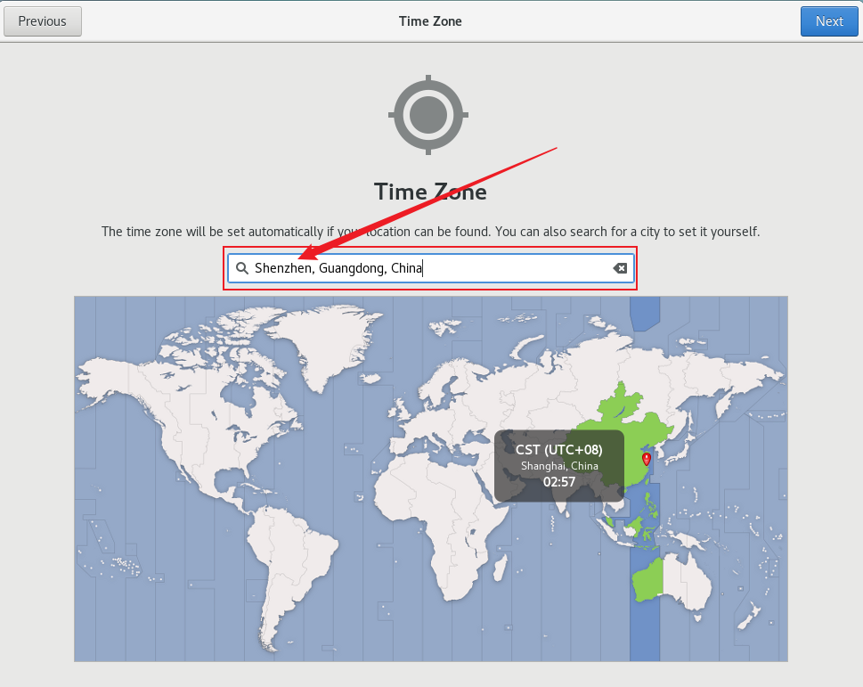
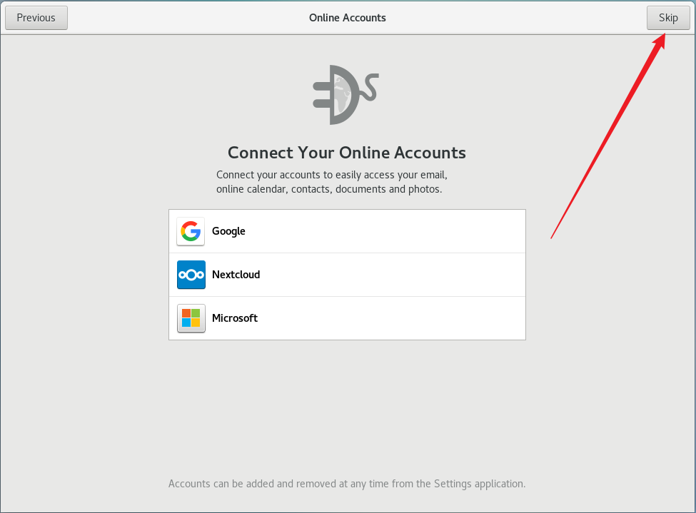
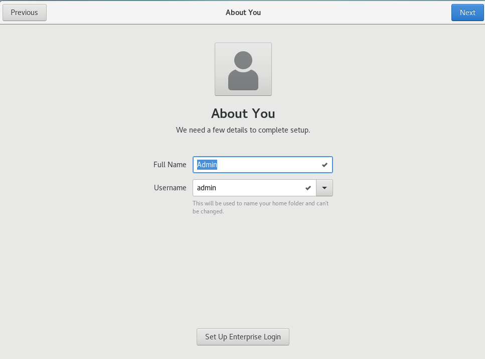
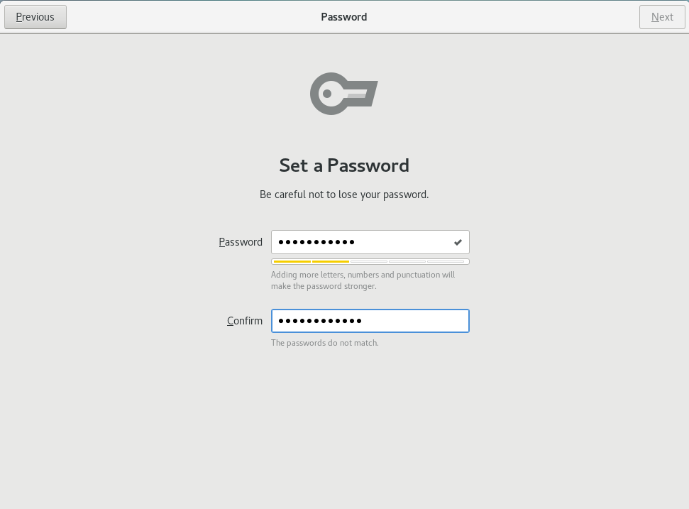
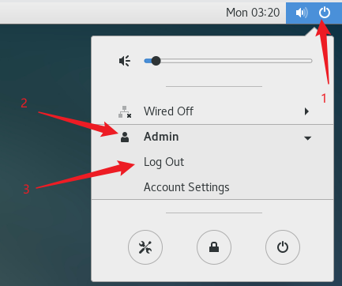
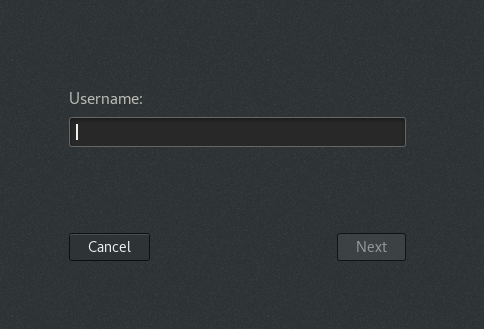

# Linux CentOS 

``` 通过 VMware 安装 Linux CentOS 7 系统 ```

1. 安装完成后进入桌面选择系统需要的语言。



2. 选择键盘，通常直接下一步。



3. 隐私，关于定位服务，直接下一步



4. 时区选择



5. 在线账号，选择跳过



6. 用户名名称与密码，这里自行填写。示例 ```Admin```，密码需要字母和其它符号并且不能包含用户名。示例 ```password...```(由于在这里创建的用户属于普通用户，所以有可能并不会使用到这个用户，此处用户名与密码随意即可)




7. 完成步骤，进入 CentOS


8. 切换到 ```root``` 用户




这里输入在安装 CentOS 时创建的 root 账号与密码

